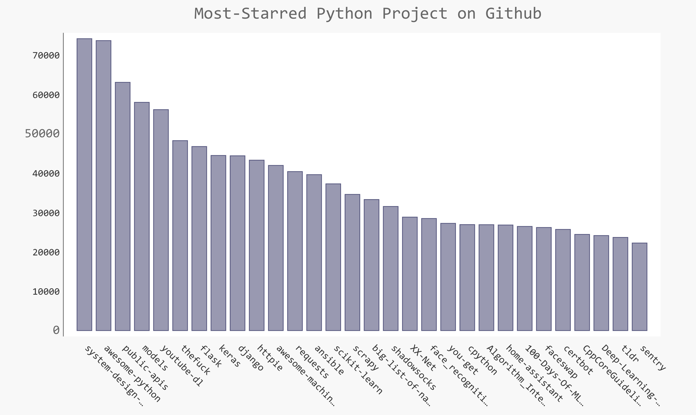

# Most-Starred-Python-Project-On-Github
Use pygal to to create a visual experience of the most starred Python project on github.

Used Github API and Python request module to get the lasted and most updated data.

